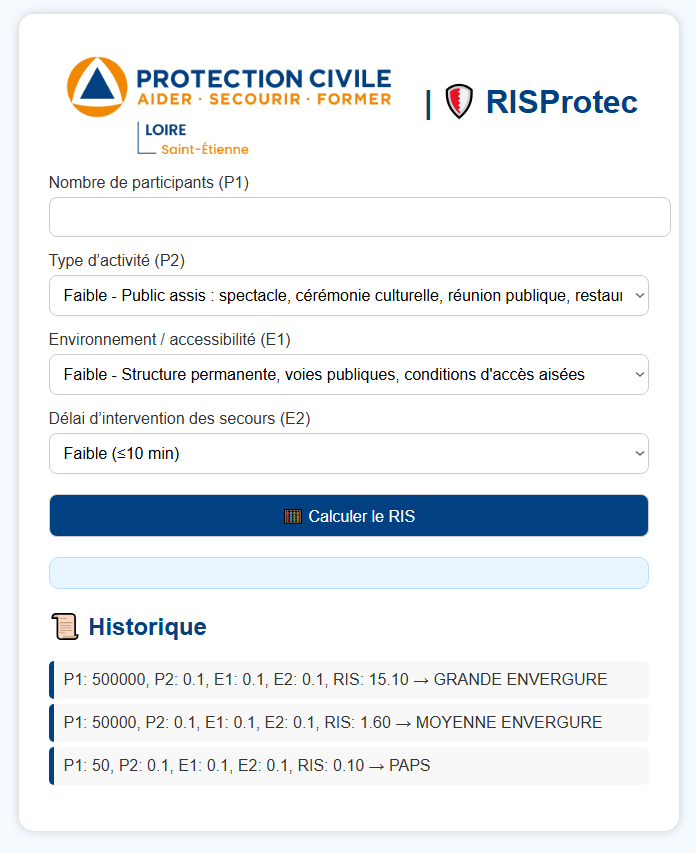

# 🛡️ RISProtec

**RISProtec** est un outil développé pour la **Protection Civile**, permettant de **calculer automatiquement le RIS** (Ratio d’Intervention de Secours) lors de la préparation d’un Dispositif Prévisionnel de Secours (DPS).  
Il reprend les données officielles de la fiche de dimensionnement et un design visuel proche de **StockProtec**.

---

## 🚀 Fonctionnalités

- Calcul du RIS à partir des critères : P1, P2, E1, E2
- Détermination automatique du type de DPS :
  - `PAPS`
  - `PETITE ENVERGURE`
  - `MOYENNE ENVERGURE`
  - `GRANDE ENVERGURE`
- Historique local des derniers calculs (sauvegarde via `localStorage`)
- Interface simple, accessible à tous (inclus descriptions longues pour les menus)
- Fonctionne **100% en local** (aucune base de données nécessaire)
- Design adapté aux standards de la Protection Civile

---

## 🖼️ Aperçu

---

## 📦 Installation

1. Télécharge le dossier complet
2. Ouvre `index.html` dans ton navigateur (aucune installation nécessaire)
3. Tu peux ajouter ton logo dans `logo.png` et ton favicon dans `favicon.png`

---

## 📜 Conditions d’utilisation

- ✅ Le projet est **gratuit et libre d’utilisation** par toute personne ou association
- ❌ Il est **interdit de modifier** le code sans autorisation explicite
- ❌ Il est **strictement interdit d’en faire un usage commercial**

> ℹ️ Ce projet est sous **licence MIT**, mais avec restrictions supplémentaires indiquées ci-dessus.  
> Si vous avez besoin de le modifier pour un usage institutionnel ou régional, merci de contacter le développeur d’origine.

---

## 👤 Auteur

Projet développé par **Mathieu Merle** – Direction Communication – [Protection Civile de la Loire – Antenne de Saint-Étienne]

---

## 📬 Contact

Pour toute question ou proposition d’amélioration, merci de contacter l’auteur ou de passer via les canaux officiels de la Protection Civile.

---

© 2025 – Tous droits réservés.
